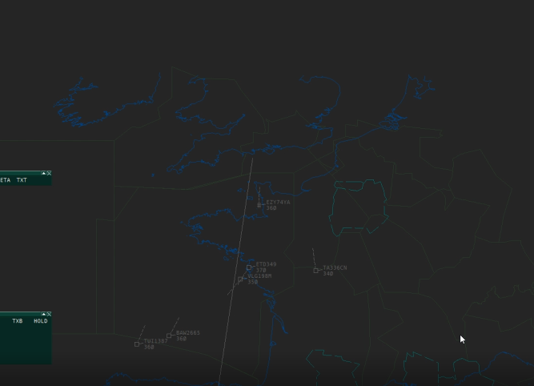
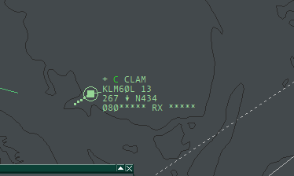
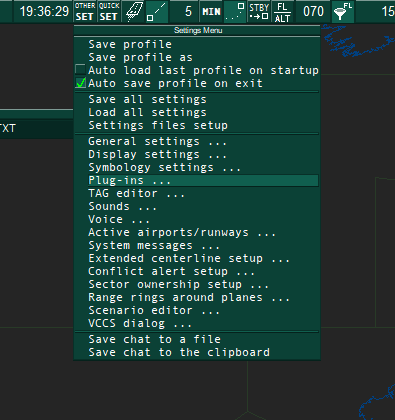
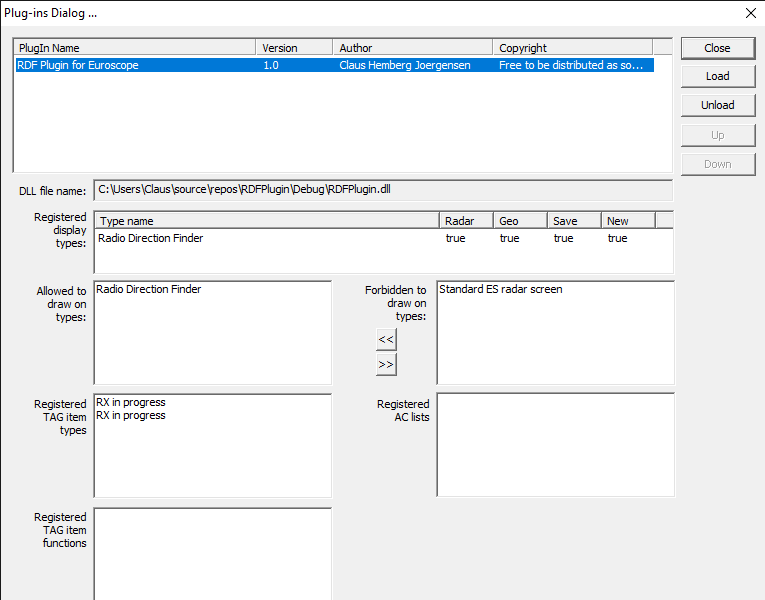
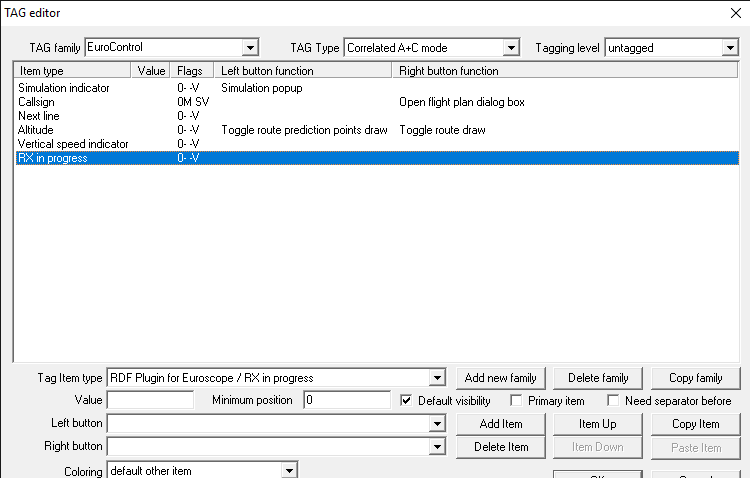

# RDF
## Radio Direction Finder plugin for Euroscope

Having problems finding the tag for the aircraft, when the pilot calls you on your frequency? At least I have had challenges with this, when covering large sectors on Vatsim, especially FSS positions. Inspired by this video (https://www.youtube.com/watch?v=KpLKP_CxaLo), showing how RDF works at Eurocontrol, I have developed this plugin, with 2 choices for letting Euroscope help you find the calling pilot.
1. Using the Radio Direction Finder view, you will get the same functionality as shown in the video: highlighting the calling aircraft by drawing a circle around the tag. 

   
   After the pilots transmission has ended, you can still get the tag highlighted by pressing the middle mouse button. 
   If the tag is outside the displayed area, a line will be drawed in the direction of the plane.
   
   
   Please note, that this only works, if you are using the Standard ES Radar View. In case you are using another plugin defining it's own views, you should probably have a look at choice no 2 below.

1. In case you are already using another radar view than Euroscope's standard radar view, I have made a "poorman's solution", where a flashing text will be displayed in the tag of the aircraft of the calling pilot.

## Installation of plugin

1. For your own sake: make a backup copy of your Euroscope folder with your settings, profiles, asr-files etc. (typically under Documents\Euroscope)
1. Download the plugin DLL from here: [RDFPlugin.DLL](raw/master/Release/RDFPlugin.dll), and move it to your Documents\Euroscope\Plugins folder
1. Start Euroscope. Click on the menu button "Other SET", and select the "Plug-ins..." menu item. 
1. The plugin dialog should now be open. Click "Load", select the just downloaded "RDFPlugin.dll", and if you click on the "RDF Plugin for Euroscope" line in the list, it should something like this (besides the DLL filename directory, of course):

1. Click "Close". That's (almost) it. 

## How to use - on Euroscope standard radar view.
If your current ES setup is using the Euroscope standard radar view, you can use the graphical RDF, where a ring is drawn around the plane controlled by the pilot currently speaking on the frequency.
1. Using a texteditor (notepad, notepad++ or whatever), open the .asr file that you are using in your ES setup. On the very first line, this text MUST be found:
   > DisplayTypeName:Standard ES radar screen
   
   If this is NOT the case, you should not continue, since this will probably break your configuration with an already installed plugin, that you are using. Instead jump to the section "How to use - on non-standard views"
1. Change this to: 
   > DisplayTypeName:Radio Direction Finder

1. Save the file, start Euroscope, and open the edited .asr-file and open it in Euroscope. Your radar screen should look no different than usual.
1. Connect to Vatsim, and enjoy that either:
   1. If the "talking aircraft" is inside your radar view, a circle is drawn around the tag. 
   1. If the aircraft is outside your radar view, a line is drawn from the screen centre in the direction of the aircraft. Scroll in the direction and you will find the aircraft.
   1. In case you forgot, which aircraft just called, just press the middle button of your mouse, and the circle will be drawn again.

No more *"Please say callsign again.."* :smile:

## How to use - on non-standard views
In case you are using another kind of radar view than the standard one, you probably also have another plugin loaded, and it's functionality would be removed, if you changed the DisplayTypeName in your .asr file, so please don't do that. As an alternative, not a great one, but at least an alternative, I have made a flashing tag, indicating the active pilot. How to install (the choice of which tag's to edit might depend on your current tag configuration as well as your choice of correlation-mode, the suggestions below will work well with correlation-mode Easy).

1. Open the TAG editor (in the menu of the "Other SET" menubutton)
1. In "TAG Type" , select "Correlated A+C mode", and for "Tagging level" select "untagged".
1. Click the "Add item" button. 
1. In the "Tag item type" drop down, replace the selection of "Next line" with "RDF plugin for Euroscope/RX in progress": 
1. In the "Tagging level" drop down switch to "tagged"
1. Once again, click "Add item", and replace the "Next line" selection with "RDF plugin for Euroscope/RX in progress".
1. Finally, click "Ok" and you are ready to connect to vatsim.

## Questions?
You can reach me on claus_hemberg.jorgensen (at) vatsim-scandinavia.org
(Disclaimer: this is my very first ES plugin, I might not have all the answers :smile: )

## Other possibilities

In case you are more into MUAC-like features in Euroscope, I can also recommend this plugin: https://github.com/pierr3/UACPlugin, that on top of other features also includes RDF functionality. In case you are only interested in RDF, and don't want to switch to an entirely new radar view, the use of my plugin would probably be preferable.
