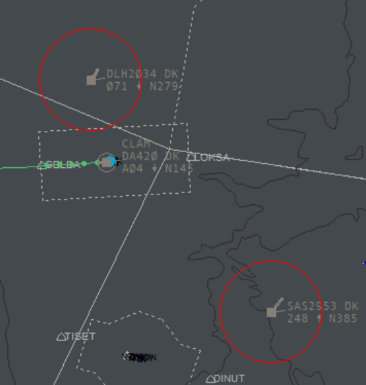

# RDF
## Radio Direction Finder plugin for Euroscope - now with AFV (Audio for Vatsim) support

Having problems finding the tag for the aircraft, when the pilot calls you on your frequency? At least I have had challenges with this, when covering large sectors on Vatsim, especially FSS positions. Inspired by this video (https://www.youtube.com/watch?v=KpLKP_CxaLo), showing how RDF works at Eurocontrol, I have developed this plugin, letting Euroscope help you find the calling pilot.

Here is an example of, how you will get the same functionality as shown in the video: highlighting the calling aircraft by drawing a circle around the tag. 

   

   After the pilots transmission has ended, you can still get the tag highlighted by pressing the middle mouse button. 
   If the tag is outside the displayed area, a line will be drawed in the direction of the plane.
   
   

   In case of simultaneous transmissions, red circles will be drawn around each aircraft.

   


   
:warning: If you are already using the TopSky plugin, versions at or above 2.2.1 beta 8, you should NOT use the RDF plugin, since the RDF functionality is already integrated in the TopSky plugin. :warning:

## Installation of plugin

Prerequisites: 
* Microsoft Visual C++ Redistributable for Visual Studio 2015, 2017 and 2019 that can be found here: 
(https://support.microsoft.com/en-gb/help/2977003/the-latest-supported-visual-c-downloads)
* AFV Standalone Client version 1.6.32 or higher.


1. For your own sake: make a backup copy of your Euroscope folder with your settings, profiles, asr-files etc. (typically under Documents\Euroscope)
1. Download the plugin DLL from here: [RDFPlugin.DLL](https://raw.githubusercontent.com/chembergj/RDF/master/Release/RDFPlugin.dll), and move it to your Documents\Euroscope\Plugins folder
1. Start Euroscope. Click on the menu button "Other SET", and select the "Plug-ins..." menu item. 
1. The plugin dialog should now be open. Click "Load", and select the just downloaded "RDFPlugin.dll"
1. Click on the "RDF Plugin for Euroscope" line in the list, and move "Standard ES radar screen" from the "Forbidden to draw on types" list to the "Allowed to draw on types" list, by clicking the "<<"  button. It should something like this (besides the DLL filename directory, of course):

1. Click "Close". That's it. 

If you want the plugin to draw on other display types than just the "Standard ES radar screen", feel free to move them from the "Forbidden..." list to the "Allowed..." list.

No more *"Please say callsign again.."* :smile:

## How to use
1. If the "talking aircraft" is inside your radar view, a white circle is drawn around the tag. 
1. If the aircraft is outside your radar view, a line is drawn from the screen centre in the direction of the aircraft. Scroll in the direction and you will find the aircraft. 
1. In case you forgot, which aircraft just called, just press the middle button of your mouse, and the circle will be drawn again.
1. In case of simultaneous transmissions, the plugin works in the same way, except that a red color is used for drawing a circle around each aircraft or a line to each aircraft outside the radar view. 
## Color configuration
As default, the circle and line is drawn in white, and in case of simulatenous transmissions, in red. In case you want to customize this, open your plugin configuration file in a text editor. The name and location of the file can be found by clicking  "Other Set", in the menu click "Settings files setup".
Inside this file, you will probably see something like this:

```
PLUGINS
<eventually existing configuration lines>
END
```


Insert a new line before the END line, and paste this into the new line:

`RDF Plugin for Euroscope:RGB:0:255:0`
`RDF Plugin for Euroscope:ConcurrentTransmissionRGB:0:255:0`

...that is, so the file now looks like this:

```
PLUGINS
<eventually existing configuration lines>
RDF Plugin for Euroscope:RGB:0:255:0
RDF Plugin for Euroscope:ConcurrentTransmissionRGB:255:255:0
END
```

After restarting Euroscope, the circle and line drawn by the RDF plugin will now be green due to the R=0, G=255, B=0 values, and yellow for concurrent transmission due to the R=255, G=255, B=0 values. You can of course set it to anything you want, as long as each value is between 0 and 255, both inclusive. In case the plugin fails to parse the line for whatever the reason must be, it will fall back to use the default white and red color.


## Questions?
You can reach me on claus_hemberg.jorgensen (at) vatsim-scandinavia.org

(Disclaimer: this is my very first ES plugin, I might not have all the answers :smile: )

## Thanks
Credit for parts of the Standalone client communication code goes to Andy and his AfvBridge https://github.com/AndyTWF/afv-euroscope-bridge/

## Other possibilities

In case you are more into MUAC-like features in Euroscope, I can also recommend this plugin: https://github.com/pierr3/UACPlugin, that on top of other features also includes RDF functionality. In case you are only interested in RDF, and don't want to switch to an entirely new radar view, the use of my plugin would probably be preferable.
